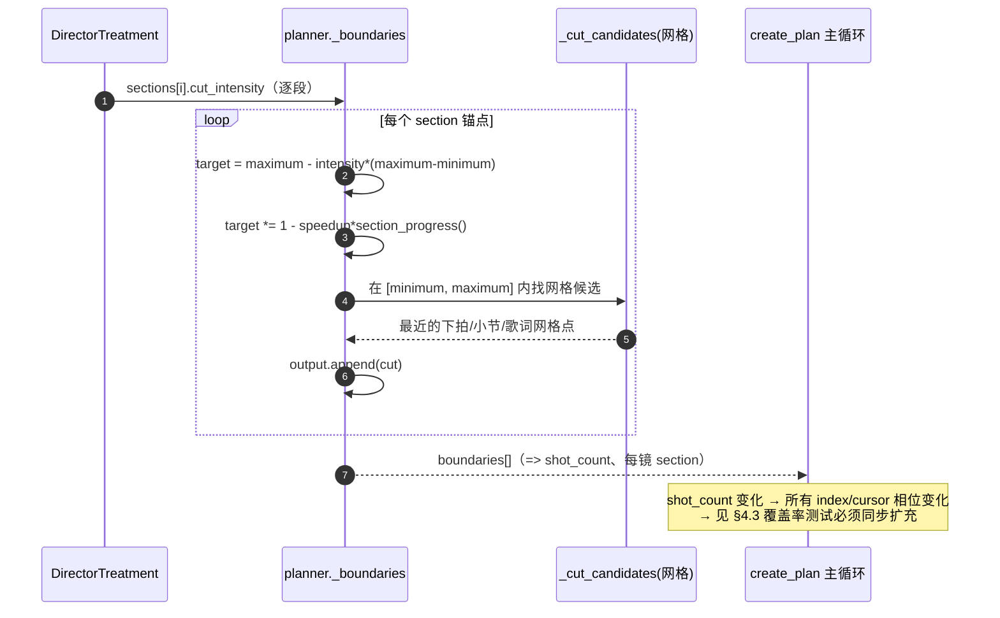
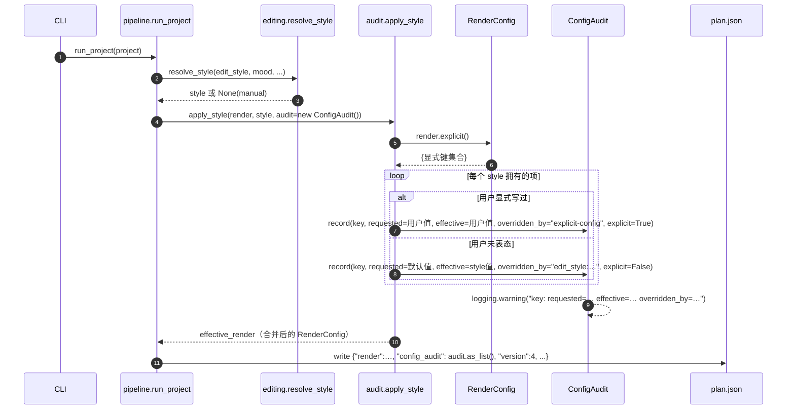
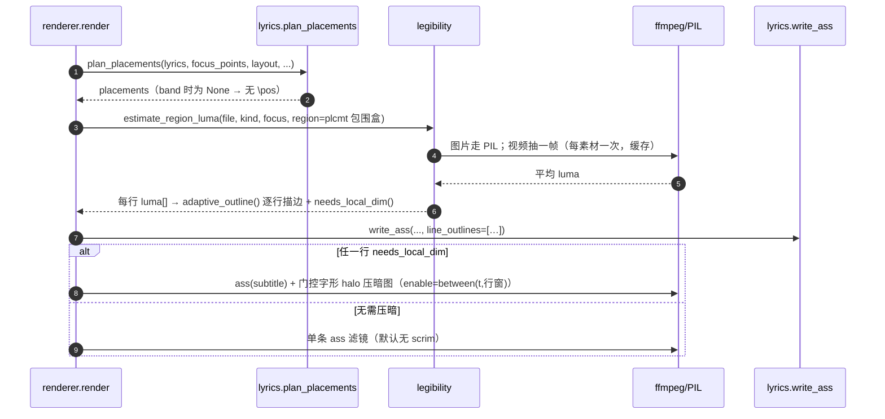

# BeatForge 质量升级系统设计与任务分解

> 架构师：高见远（Gao）｜2026-09-22
> 输入：`beatforge-quality-diagnosis.md`（实测诊断）、`beatforge-quality-prd.md`（R-01…R-12）、`README.md`、
> `beatforge/`（逐行核对）、`demo/` 与 `my-mv/`（两份有效工程）
> 范围：本轮改造 = PRD 的 6 条 P0 全做 + 5 条 P1 全做 + R-11（用户已拍板移除）+ R-12（仅探针断言，无新逻辑）。
> **本文件只做设计，不含实现代码**；`beatforge/` 下任何文件均不改动。

---

## 0. 先做的一件事：复核行号（trust but verify）

诊断/PRD 引用的行号我逐条在源码上核对过，**全部对得上**，仅两处需要精确化，以我读到的代码为准：

| 诊断/PRD 引用 | 复核结果 |
| --- | --- |
| `planner.py:94-97` style 无条件接管 | ✅ 正是 `create_plan` 顶部 |
| `pipeline.py:151` 静默覆盖 `subtitle_layout` | ✅ 实为 **149-152 行**（`model_copy(update=...)`），PRD 只列了镜长/转场/多图三项却漏了它 |
| `editing.py:161-169` `_MOOD_STYLES` | ✅ `_MOOD_STYLES` 在 **158-169**，`resolve_style` 在 172-189 |
| `renderer.py:137-153` `_subtitle_placements` | ✅ |
| `planner.py:589` camera_motion 参与打分 | ✅ 在 `_motion_fit`（586-596）里，是**视频**分支唯一读它的地方 |
| `models/ai_director.py:392` 喂给导演 | ✅ `_build_context` 的 asset 条 |
| `renderer.py:864-895` 单图虚化双胞胎 | ✅ `_adapt_image_layers`(864-884) + `_adapt_image`(887-895) |
| `renderer.py:196-200 / 251-254` 三层调色 | ✅ 视频/图片两分支各三算子 |
| `renderer.py:210/259` vignette、`213/261` noise、`970-978` encode | ✅ |

**新发现（诊断没写、但对设计有影响）**：`_framing_effect`（`planner.py:398-411`）在 `.085` 的门控下会返回 `iris`/`parallax`/`film_bars`；`parallax` 是**三个** framing 效果之一，且 `_image_filter_graph`（`renderer.py:631-637`）有专门分支。R-04 移除 `parallax` 必须连同这个门控一起改，否则会出现「planner 点名 parallax、renderer 不认」的静默降级。

---

## 1. 实现方案（逐条 R-01…R-12）

### 总纲：一条数据流被重新划分

本轮的核心不是「加效果」，而是**把整片编排的收敛权交给三个明确的责任方**，并让每一次「程序替用户做的决定」都留痕：

```
用户显式配置 ──┐
              ├─► 生效配置(effective) ─► planner / renderer      ─► plan.json(config_audit)
edit_style  ──┘        （显式优先，style 只接管未表态项）              （任何覆盖都进链）
AI 导演 cut_intensity 弧 ─► _boundaries 逐段镜长 ─► 镜头边界 ─► 下游一切 cursor/相位
AI 导演 motif_asset_ids  ─► _motif_schedule 保留位 ─► 选镜主循环
```

---

### R-01（P0）剪辑节奏跟随导演逐段强度弧

**落点**：`beatforge/planner.py::_boundaries`（431-478），新增 `_section_target_length`；`beatforge/editing.py::resolve_style`（172-189）不变但语义收窄。

**现状**：`_boundaries` 用 `style.tempo - energy*gain` 求 `ideal`，`cut_intensity` 只作为一个 ±35% 的乘子（`1.25 - intensity*.65`），且被 `clip(..., minimum, maximum)` 夹在风格窗口里。my-mv 生效窗口是 beat 的 `.55–1.9`，所以强度弧无论多低都出不了长镜。

**改法（为什么这样改）**：把「谁决定镜长」倒过来 —— **强度弧决定目标镜长，风格只提供窗口与网格**。在没有导演方案（`--no-ai`、规则回退）时，回落到旧公式，保证 demo 回归面不变。

```python
# _boundaries 内，替换原 ideal 计算
intensity = direction.cut_intensity if direction else _default_intensity(section)
span = maximum - minimum
target = maximum - intensity * span          # 强度 1 → 最短，强度 0 → 最长
target *= 1 - speedup * _section_progress(...)   # 段落内仍向顶点收紧
ideal = cursor + float(np.clip(target, minimum, maximum))
```

- 数据流：`DirectorTreatment.sections[i].cut_intensity` → `_boundaries` 逐段的 `target` → 网格吸附 → `output[]` 边界 → `shot_count` 与所有 `index/cursor` 相位。
- 为什么不是「调 style 窗口」：用户决策 #1 已定**显式配置优先**，my-mv 写了 `1.8/5.5`，窗口由用户值决定。style 只决定窗口的**兜底**（用户没写时）。
- 为什么不是「把 tempo/energy 权重调大」：那仍然是「一个数压十段」，正是诊断 P0-A 的成因。

**验收与既有契约的冲突处理**：PRD R-01 写「`max_shot ≤ 所选风格的 shot_max`」，但用户决策 #1 下 my-mv 的生效上界是 **5.5**（用户显式值）而非 beat 的 1.9。**以显式配置为准**，R-01 判据改为 `max_shot ≤ 生效窗口上界`（见 §8 待明确项 1）。

---

### R-02（P0）通则：任何覆盖必须在日志与产物中显式声明（跨条目优先）

**落点**：新建 `beatforge/audit.py`（`ConfigAudit` / `ConfigOverride`）；`beatforge/config.py`（新增 `explicit()` 与两个「已废弃但仍接收」字段）；`beatforge/pipeline.py::run_project`（`apply_style` 调用 + `plan["config_audit"]`）。

**统一采集点（这是重点）**：**只有一个入口**——`apply_style(render, style, audit)`。所有「style 接管 render」的动作都必须经过它；任何地方**禁止**自己 `print`/`logging.warning` 覆盖信息。采集点唯一化，才有 `test_no_silent_config_override` 可断言。

```python
# beatforge/config.py
class RenderConfig(BaseModel):
    def explicit(self) -> frozenset[str]:
        return frozenset(self.model_fields_set)   # pydantic v2：用户显式写过的键

# beatforge/audit.py  —— 显式优先的判定就在这一处
def apply_style(render: RenderConfig, style: EditStyle | None, audit: ConfigAudit) -> RenderConfig:
    if style is None:
        return render
    owned = {"min_shot_seconds": style.shot_min, "max_shot_seconds": style.shot_max,
             "transition_density": style.transition_density,
             "image_composite_ratio": style.composite_ratio,
             "subtitle_layout": style.subtitle_layout}
    explicit = render.explicit()
    updates = {}
    for key, value in owned.items():
        if key in explicit:                        # 显式配置优先 → 不改，但记录「风格不认同」
            if getattr(render, key) != value:
                audit.record(key, requested=getattr(render, key), effective=getattr(render, key),
                             overridden_by=f"explicit-config", explicit=True)
            continue
        if getattr(render, key) != value:          # 未表态 → style 接管，必须留痕
            audit.record(key, requested=getattr(render, key), effective=value,
                         overridden_by=f"edit_style:{style.label}", explicit=False)
            updates[key] = value
    return render.model_copy(update=updates) if updates else render
```

- `ConfigAudit.record` 内部一行 `logging.warning("%s: requested=%r effective=%r overridden_by=%s", ...)`，并 append 到 `self._items`。
- `plan.json` 落 `config_audit`（机器可读，字段 `key/requested/effective/overridden_by/explicit`）。
- **同源缺陷一并纳入同一 audit**：`speech_source` 的「人声分离降级」、旧 sidecar 里的 `camera_motion`（R-11）、废弃配置项 `blurred_image_background`/`image_foreground_scale`（用户决策 #2）——都走 `audit.record(overridden_by="deprecated-key" | "separate-vocals-unavailable")`，不再各写各的 `print`。
- **对 `test_no_silent_config_override` 的影响（重要）**：因为显式优先，**my-mv 现在两个字段都不算被覆盖**（1.8/5.5 与 band 都生效）。测试必须写成**两个 fixture**：(a) 显式 → 断言 `config_audit` 里这两项 `effective==requested`、无 WARNING；(b) 未表态（用默认值构造）→ 断言出现 `requested/effective/overridden_by` 三字段且 `caplog` 有 WARNING。这条改动直接决定测试怎么写。

---

### R-03（P0）母题必须复现；复用从「越少越好」改为「非母题零复用 + 母题按段落复现」

**落点**：`beatforge/planner.py::create_plan`（主循环 122-247）；新增纯函数 `_motif_schedule(shot_sections, motifs, *, min_repeats, share)`；`_least_used_assets`(255-263) 与 `spare_assets`(137) 的计算改为「非母题口径」；`chorus_motifs`(109,152,172-173) 整体删除。

**难点 C 的正面解法（母题保留位 × `least_used`/`spare_assets`）**：

1. **先定时序、再选镜**。循环前先算 `reserved: dict[int, int]`（`shot_index → motif_asset_id`），由 `_motif_schedule` 生成：
   - 按段落轮转分配：段 `s` 分给 `motifs[s % len(motifs)]`，让每个母题落到「它出现的段落」；
   - 每个母题目标次数 `max(min_repeats, round(shot_count * share / len(motifs)))`，`min_repeats=3`、`share=_MOTIF_SHARE≈0.10`（常量，供 `reuse_probe.py` 调参）；不足则继续按段轮转补足；
   - 纯索引推导、无随机，保证同一 plan 可复现；`shot_count` 过小时优雅降级（少留几个位）。
2. **把母题从「新素材供给」里摘出来**，`spare_assets` 用非母题口径重算：

```python
M = set(motifs)
non_motif_least = [a for a in least_used if a.id not in M]
reserved_remaining = sum(1 for i in reserved if i >= index)
spare_assets = len(non_motif_least) - (remaining_shots - reserved_remaining)
```

   这样「多图辅助层只在有富余时才能花」的既有语义**按素材真实紧张度**保留：母题保留位不再被误当成「供给充裕」，也不会把非母题的新素材耗尽。
3. **选镜**：
   - `reserved.get(index)` 命中 → 直接选该母题（此镜 `is_motif=True`，跳过「重复歌词不重复画面」过滤之外的 tier 逻辑）；
   - 否则在**非母题**候选的 `least-used` 层里选（`tier` 逻辑只作用于非母题），**只要池中还有未用过的非母题素材，就绝不选已用过的非母题** —— 这就是 R-03 的硬约束；
   - 母题**只**通过保留位（或全部素材都耗尽）出现，绝不在非保留位被「顺手」消费。

- 删除 `chorus_motifs`（`planner.py:109/152/172-173`）及其「上限 2」：上限由 `DirectorTreatment.motif_asset_ids`（≤5）+ `_motif_schedule` 控制。
- `plan.json` 新增 `motif_appearances: {asset_id: count}`；`Shot` 新增 `is_motif: bool`。
- **行为变更需同步 README**：README §489「素材够用时全片零复用」→ 改为「非母题零复用；母题按段落复现（每母题 ≥3 次）」；`scripts/reuse_probe.py` 期望输出同步改。
- **与不变式的关系**：非母题零复用是原不变式的**加强**而非削弱；`test_assets_are_never_shown_twice_when_supply_is_sufficient`（`tests/test_planner.py:294`）需改为「非母题不重复 + 母题按契约复现」。

---

### R-04（P0）单图禁止「同图虚化双胞胎 + 硬边内嵌」；一帧至多一个画框

**落点**：`beatforge/renderer.py`：`_render_image_shot`(241)、`_image_filter_graph`(606)、`_fill_frame`(898)、`_adapt_image_layers`(864)/`_adapt_image`(887)（删除）、`_framing_effect`（在 `planner.py`）。

**统一改法**：单图与视频走**同一条主体感知全出血路径**（用户决策 #2）。`_adapt_image*` 整体删除；单图在 `_image_filter_graph` 里生成一个 canvas 尺寸的全出血帧，用 `focus_point` 做裁切原点（与视频 `renderer.py:191-194` 同一套 `clip(iw*focus-ow/2,0,iw-ow)`）。

```python
def _fill_frame(filters, input_index, label, width, height, *,
                focus=None, full_range=False) -> None:
    """全出血：cover 缩放 + 主体感知裁切，无留边、无同源副本。"""
    x = f"clip(iw*{fx}-ow/2,0,iw-ow)" ...   # focus 有值时按主体裁，否则居中
    range_arg = ":in_range=full:out_range=limited" if full_range else ""
    filters.append(f"[{i}:v]scale={w}:{h}:force_original_aspect_ratio=increase:flags=lanczos,"
                   f"crop={w}:{h}:x='{x}':y='{y}'{range_arg},setsar=1,format=yuv420p[{label}]")
```

**难点 A 的三个运镜处置（这是本设计的显式决定）**：

| 运镜 | 现状依赖 | 决定 | 理由 |
| --- | --- | --- | --- |
| `parallax` | 字面由 `_adapt_image_layers` 把同图 split 成「虚化满屏背景 + 清晰缩放前景」两平面 | **整体移除** | 它的定义**就是** R-04 要禁止的机制。没有深度模型，重建「既非双尺度副本、又真是视差」的景深错觉在数学上做不到——任何替代都只是给普通推移改个名。删除：`_framing_effect` 的 `parallax` 分支、`_image_filter_graph:631-637` 的分支、`_PARALLAX_BACK/_PARALLAX_FRONT`。`_framing_effect` 收敛为 `iris` / `film_bars` / `""` 三选一（降低加框频率，天然满足「一帧 ≤1 画框」）。 |
| `focus_pull` | README §379「清晰前景配柔化背景的缓推」；单图全出血后背景被完全遮住 → 退化为普通小推进 | **重新定义**（不做双尺度副本） | 「对焦」属于**清晰度轴**，不是**取景轴**。把柔化从「空间（背景）」搬到「时间（整体）」，做成真正的**变焦/机内对焦**：同一张全出血帧 `split` 成 `[sharp][soft]`（soft 走 `gblur`），用 `blend` 的 `all_expr` 按 `T` 加权交叉淡入，配合原有的小幅推进。两个流**同尺度**，不构成双尺度副本，因此过 R-04 谓词。`blend` 已验证支持时间线（`enable`）且 `all_expr` 可用 `T`；`gblur` 的 `sigma` 是 `..T.` 选项但无内联表达式，故此方案优于 `sendcmd`。 |
| `beat_montage` | README §418 明确它是**唯一有意保留留边**的合成，理由是「一次只显示一张，无第二块场、无同尺度重复」 | **保留留边，但把留边从「同图虚化底」换成「主导色平铺底」** | R-04 要消灭的是**同源双尺度副本**，不是「内缩」本身。beat_montage 一次只显示一张图，其内缩有独立的读法价值（读成「一串照片」）。保留内缩、只把背景换成 `shot.source_color` 的纯色/竖向渐变（新增 `_matte_frame`），即：去掉最脏的那一层，保住已文档化的意图，且帧内加框元素仍 ≤1。 |

> 说明：`_adapt_image*` 被删后，其唯一残留使用者 beat_montage 改用「`_fill_frame` 缩到内缩框 + `_matte_frame` 铺底」，`test_beat_montage_keeps_its_letterbox_on_purpose` 改为断言「内缩保留、且**不含同源 gblur 副本**」。

**图级谓词（单测，可字符串判定）**：单图镜头滤镜图必须**不含** `force_original_aspect_ratio=decrease`（内嵌前景的判据）；且必须含 `force_original_aspect_ratio=increase`。这条同时覆盖 `gblur`（focus_pull 的 gblur 是**允许**的，因为它没有 `decrease` 前景）。

**需同步的 README/测试**：README §375、§412、§397（parallax 段）、§379（focus_pull 段）、§418（beat_montage 段）改写；`tests/test_renderer.py` 的 `test_a_single_image_still_gets_its_blurred_backdrop`（1134）**反转**为新断言、`test_beat_montage_keeps_its_letterbox_on_purpose`（1117）改写、`test_all_still_image_effects_render`（148）与 `test_planned_effects_are_all_names_the_renderer_can_build`（`test_planner.py:479`）参数集去掉 `"parallax"`。

**像素级判据**（探针）：复用 `scripts/composite_probe.py` 的四形状源，新增竖图渲进 16:9 的检查（接缝阶跃、同图双尺度 NCC、加框元素计数）——落到 `scripts/delivery_probe.py` 或扩 `composite_probe.py`。

---

### R-05（P0）字幕：配置保真 + 全背景可读 + 配色一致 + 在屏达标

**落点**：`beatforge/renderer.py::_subtitle_placements`(137)/`_knockout_graph`(107)/`render` 的 62-86 段；`beatforge/lyrics.py::write_ass`(366)/`plan_placements`(203)/`_split_line`(323)；新建 `beatforge/legibility.py`。

**难点 D 的正面解法：背景亮度从哪来**

- **取数方式（纯 CPU、无模型、可测）**：新建 `beatforge/legibility.py::estimate_region_luma(file, kind, focus, region, cache_dir)`：
  - **图片**：`PIL` 打开 → `thumbnail` → 按归一化 `region` 裁块 → 平均 luma。与 `media.py::_visual_quality` 同一手法，纯 CPU。
  - **视频**：用 `ffmpeg` 抽一帧（shot 的 `source_start` 处）到 `cache/legibility/<media_id>.png`（**每素材只抽一次**），再走图片路径。ffmpeg 是既有依赖，测试已普遍调用。
  - 结果按素材/镜头缓存，确定性可复现。
- **`region` 从哪来**：`band` 版式 = 底部字幕带（`y∈[H-margin-size, H]`）；`free` 版式 = 该行 placements 的归一化包围盒。所以顺序是**先 `plan_placements` 定落点，再测该落点区域的亮度**，最后生成 ASS。

**两条机制**（用户决策 #3：自适应描边 + 局部压暗，**不加 scrim**）：

1. **自适应描边（始终生效，逐行写进 ASS）**：`legibility.adaptive_outline(luma, base, bright=0.55, max_outline=2.4)` → 亮背景加粗、暗背景减细；`write_ass` 新增 `line_outlines: list[float] | None`，每行发 `\bord<w>`。**这是打亮沙滩可读性的主杠杆**。
2. **局部压暗（仅在需要时启用，字后区域）**：复用已验证的 `_knockout_graph` 结构，把「填充提升」换成「填充压暗」，并用 `enable='between(t,s1,e1)+...'` 把整张图**只在该行在屏窗口内启用**——因为某行只在它自己的时间窗里可见，门控后等价于「只对该行字形区域压暗」。没有任何 `needs_local_dim` 行为真时，直接走原来的单条 `ass` 滤镜（**默认帧无 scrim**，保持参考片「字在画面里」的观感）。

**其余两条**：
- **配色一致**：`write_ass` 里所有**静态** `\1c{_WHITE}` 基线覆盖（`float`/`typewriter`/`spotlight`/`neon` 等）移除，基线色统一 = `config.subtitle_highlight_color`（样式 `PrimaryColour` 单值）；只保留 **动画内** 的 `\t(...\1c...)`（`rainbow`、`neon_flicker`、`glitch` 这类**由颜色定义**的效果）。判据：**静态** `\1c` 取值集合 ≤1（见 §8 待明确项）。
- **配置保真**：`subtitle_layout="band"` 时 `plan_placements` 返回 `None`、`write_ass` 不发 `\pos`（`_anchor` 已只在有 placement 时发）。这条同时受 R-02 保护（不再静默被改成 free）。
- **在屏时长**：新增 `lyrics.merge_short_lines(lines, minimum=0.6)`，把 <0.6s 的行合并进相邻行（R-05「每事件 ≥0.6s」）；`_split_line` 另把 <0.6s 的**分片**并入相邻片（R-10）。

**测试/探针**：`tests/test_lyrics.py` 断言 band→`\pos`=0、静态配色集合=1、最短事件；新增 `scripts/subtitle_legibility_probe.py` 用受控亮/暗底渲染带字幕帧与无字幕帧，测字形掩码 `|Δluma|` 的 P10/min。

---

### R-06（P0）调色层数收敛 + 暗角/颗粒条件化 + limited-range 交付

**落点**：`beatforge/renderer.py`：`_shot_match_filter`(932)/`_section_color_filter`(944)/`art.grade_filter` 三处 → 合并为 `_grade_filter`；`renderer.py:210/259`（vignette）与 `213/261`（noise）条件化；`_video_encode_args`(970)。

**改法**：
- **调色 ≤2 算子**：新增 `_grade_filter(shot, art, section_count, cfg) -> list[str]`，把 `shot_match` 的 `eq`、`grade_filter` 的 `eq/colorbalance`、`section_color` 的 `colorbalance` **合并**为：至多一个 `eq`（brightness/contrast/saturation 合并）+ 至多一个 `colorbalance`（向量相加）。**总 saturation 增益夹到 ≤1.10**（乘性合并后 clamp）。判据：每镜「改变 luma 或 saturation 的算子树」≤2。
- **暗角条件化**：`vignette` 仅当 `shot.edge_luma >= 0.19`（≈48/255）时附加。`edge_luma` 由 `media.py` 新增采集（见 §3），经 `MediaAsset → Shot` 搬运（与 `source_color` 同一条管线）。
- **颗粒条件化**：`noise` 仅当 `shot.noise_score < 阈值` 时附加（源已含噪则 `alls=0`）。`noise_score` 同样由 `media.py` 采集。
- **limited-range**：图片链路在 `_fill_frame`/收尾 `scale` 上加 `in_range=full:out_range=limited`（`scale` 已确认支持这两个选项）；`_video_encode_args` 追加 `["-color_range", "tv"]`。视频源按默认（limited）不强制。
- **R-12（P2）**：**无新增逻辑**——颗粒条件化后编码器不再为噪点花钱，体积自然回落；只加 `scripts/delivery_probe.py` 断言「固定 `crf=19` 下体积/码率下降 **且** `noise=alls` 相对基线下降」（两条同时成立，禁止抬 CRF 换体积）。

**行为变更**：交付像素格式 `yuvj420p → limited`，旧工程重渲整体亮度/对比有轻微可见变化，需写进 README + release note。

---

### R-07（P1，本轮做）转场词汇收敛 + 冲击型由逐段 `transition_tone` 授权

**落点**：`beatforge/planner.py::_transition_family`(700)/`_structural_family`(752)/`_INSIDE_POOLS`(668)。

**改法**：
- **冲击型授权门**：`flash/glitch/film_burn/zoom/light_leak` 只在「所在 director section 的 `transition_tone ∈ {bright,dark}` 或 `edit_intent=="impact"`」时才允许出现；否则经 `_QUIET_SWAPS` 降级（既有机制）。当前 `_structural_family` 在 `following.energy>0.78` 时无条件返回 `flash/glitch/light_leak` —— 这正是「温情纪实上 58 个冲击型」的来源。
- **族数收敛**：缩短 `_INSIDE_POOLS` 各级轮转长度，使同片族数 ≤8、具体种类 ≤12 可达。
- 判据落到 `plan.json` 统计（探针 `edit_style_probe.py` 扩展）。

### R-08（P1，本轮做）视频素材配额下限

**落点**：`beatforge/planner.py::create_plan` 主循环。仿 R-03 的保留位机制做一个**软配额**：`video_target = round(shot_count * 0.15)`，在有可用视频时按「已用视频数 < 配额按剩余比例折算」给视频加分/收紧候选，保证视频镜头 ≥15%。这与「逐镜竞争」不冲突，只是把「真实运动被静态图淹死」的结构性偏差按配额纠回来。

### R-09（P1，本轮做）素材质量硬闸门

**落点**：`beatforge/planner.py::create_plan` 候选过滤。闸门：`quality_floor = quantile(assets.quality_score, 0.05)`；主镜头候选先剔除 `< floor` 的素材，仅当可用素材不足时才放行，且**降级必须经 `ConfigAudit` 显式声明（降级素材数 + 原因）**（R-02 通则）。这条直接拦掉 `out_05_130s.png` 那种「拍屏照片」。

### R-10（P1，本轮做）字幕落位不压主体 + 分片不短于在屏阈值

**落点**：`beatforge/lyrics.py::plan_placements`(203)/`_choose_layout`(246)。现有二维避让（`_clears`，295-306）保留；新增：
- **与主体 bbox 重叠面积 ≤5%**：把 `focus_point` 从「点」升级为「小 bbox」（由素材阶段估一个保守尺度），`_clears` 改为面积重叠判据。
- **<0.6s 分片合并**：`_split_line` 返回前检查每片在屏跨度，短于阈值并入相邻片（不独立成事件）。

### R-11（P2，本轮做：用户已拍板移除）`camera_motion` 整体移除

**落点**：`beatforge/media.py`（`MediaAsset` 删字段 + 删 sidecar 读取）、`beatforge/planner.py`（`Shot` 删字段 + `_motion_fit` 删视频分支）、`beatforge/models/ai_director.py::_build_context`(385-395 删字段)、`pipeline.py`（plan 里不再出现）。旧 sidecar 仍带 `camera_motion` 时，经 `audit.record(overridden_by="deprecated-key")` 记录。README §548 sidecar 示例删该字段。

### R-12（P2，本轮做：仅探针）交付体积回落来自颗粒减少

见 R-06 末段：判据落 `scripts/delivery_probe.py`，无新逻辑。

---

## 2. 文件列表（相对路径，相对 `D:\code\BeatForge`）

**新建**
| 文件 | 职责 |
| --- | --- |
| `beatforge/audit.py` | `ConfigAudit`/`ConfigOverride`/`apply_style`：唯一覆盖审计入口 |
| `beatforge/legibility.py` | 背景亮度取数、自适应描边、局部压暗判定 |
| `scripts/subtitle_legibility_probe.py` | R-05 像素级探针（字形掩码 Δluma） |
| `scripts/delivery_probe.py` | R-06/R-12 交付元数据探针（range/pix_fmt/体积/颗粒） |

**修改**
| 文件 | 改动摘要 |
| --- | --- |
| `beatforge/config.py` | `explicit()`；两个废弃但接收的字段；`_grade_filter` 相关配置若需要 |
| `beatforge/planner.py` | R-01 边界、R-03 母题、R-07 转场授权、R-08 视频配额、R-09 质量闸门、R-11 删字段 |
| `beatforge/editing.py` | 风格语义收窄为「窗口兜底」；`shot_max` 作为生效上界语义澄清 |
| `beatforge/media.py` | 新增 `luma/edge_luma/noise_score`；删 `camera_motion` |
| `beatforge/renderer.py` | R-04 单图全出血（删 `_adapt_image*`）/parallax 删/focus_pull 重定义/beat_montage matte；R-06 调色合并+条件化+limited；R-05 字幕接线 |
| `beatforge/lyrics.py` | R-05 逐行描边/配色统一/`\pos`=0；R-10 分片合并与 bbox 避让；`merge_short_lines` |
| `beatforge/director.py` | `ArtDirection` 传递可读性所需字段（如 `subtitle_max_outline`） |
| `beatforge/models/ai_director.py` | brief 删 `camera_motion` |
| `beatforge/pipeline.py` | `apply_style` + `config_audit` + `motif_appearances` + `version:4` + 传 `motifs`/`audit` |
| `scripts/reuse_probe.py` | 期望输出同步（母题复现契约） |
| `scripts/edit_style_probe.py` | 增加 R-01/R-07 统计 |
| `scripts/subtitle_layout_probe.py` | 增加 band `\pos`=0 与描边自适应检查 |
| `tests/test_config.py` | `test_no_silent_config_override`（双 fixture）、`explicit()` |
| `tests/test_planner.py` | 边界/母题/转场/配额/闸门；**两条跨歌覆盖率测试扩充**（见下） |
| `tests/test_renderer.py` | 单图谓词反转、beat_montage 改写、focus_pull 新形态、encode args range |
| `tests/test_lyrics.py` | band/配色/最短事件/分片合并 |
| `tests/test_pipeline.py` | `config_audit`/`motif_appearances`/`version:4` |
| `tests/test_media_quality.py` | 新指标 |
| `README.md` | 见 §7 变更清单 |

---

## 3. 数据结构与接口

### 3.1 新增/变更 dataclass 与字段

```python
# beatforge/audit.py （新建）
@dataclass(slots=True)
class ConfigOverride:
    key: str                 # 如 "min_shot_seconds"
    requested: object        # 未被覆盖时的值（用户显式值，或默认值）
    effective: object        # 实际生效值
    overridden_by: str       # "edit_style:卡点快剪" | "explicit-config" | "deprecated-key" | ...
    explicit: bool = False   # requested 是否来自用户显式声明

class ConfigAudit:
    def record(self, key, requested, effective, overridden_by, *, explicit=False, reason="") -> None: ...
    def as_list(self) -> list[dict]: ...           # 写进 plan.json

def apply_style(render: RenderConfig, style: EditStyle | None, audit: ConfigAudit) -> RenderConfig: ...
```

```python
# beatforge/media.py
@dataclass(slots=True)
class MediaAsset:
    ...                                  # 删除 camera_motion
    luma: float = 0.5                    # 新增：主体附近平均亮度（归一化）
    edge_luma: float = 0.5               # 新增：画面边缘亮度（暗角门控）
    noise_score: float = 0.0             # 新增：高频能量（颗粒门控）

# beatforge/planner.py
@dataclass(slots=True)
class Shot:
    ...                                  # 删除 camera_motion
    is_motif: bool = False               # 新增：本镜是否为母题保留位
```

```python
# plan.json（version 3 → 4）新增顶层字段
{
  "version": 4,
  "config_audit": [{"key","requested","effective","overridden_by","explicit"}, ...],
  "motif_appearances": {"217": 4, "31": 3, ...},          # asset_id -> 出现次数
  "shots": [ {..., "is_motif": false}, ... ],              # 且不再含 camera_motion
  "media": [ {..., "luma": .., "edge_luma": .., "noise_score": ..}, ... ]  # 不再含 camera_motion
}
```
> **向后兼容**：消费 v3 的读者遇到缺失的 `config_audit`/`motif_appearances` 一律视为空；`camera_motion` 移除后不得被任何代码读取。

### 3.2 关键函数签名

```python
# planner.py
def create_plan(..., style: EditStyle | None = None,
                audit: ConfigAudit | None = None,
                motifs: list[int] | None = None,
                video_quota: float = 0.0,
                quality_floor: float = 0.0) -> list[Shot]: ...

def _boundaries(analysis, lyrics, minimum, maximum,
                treatment=None, style=None) -> list[float]: ...      # R-01：cut_intensity 驱动
def _section_target_length(intensity: float, minimum: float, maximum: float, ...) -> float: ...
def _motif_schedule(shot_sections: list[str], motifs: list[int], *,
                    min_repeats: int = 3, share: float = _MOTIF_SHARE) -> dict[int, int]: ...  # 纯函数
def _motion_fit(asset, energy) -> float: ...      # 不再读 camera_motion

# renderer.py
def _fill_frame(filters, input_index, label, width, height, *,
                focus=None, full_range=False) -> None: ...           # 全出血、主体感知
def _matte_frame(filters, input_index, label, width, height, colour) -> None: ...  # beat_montage 平铺底
def _focus_pull(filters, label, cfg, frames, ...) -> str: ...        # blend + T 交叉淡化
def _grade_filter(shot, art, section_count, cfg) -> list[str]: ...   # ≤2 算子
def _vignette(shot, art) -> str: ...                                 # edge_luma 门控
def _grain(shot, art) -> str: ...                                    # noise_score 门控
def _video_encode_args(cfg, *, intermediate) -> list[str]: ...        # + ["-color_range","tv"]
def _subtitle_placements(lyrics, shots, cfg) -> list[list[Placement]] | None: ...  # 不变签名

# legibility.py（新建）
def estimate_region_luma(file: Path, kind: str, focus: tuple[float,float] | None,
                         region: tuple[float,float,float,float], cache: Path) -> float: ...
def adaptive_outline(luma: float, base: float, *, bright: float = .55, max_outline: float = 2.4) -> float: ...
def needs_local_dim(luma: float, *, threshold: float = .66) -> bool: ...

# lyrics.py
def merge_short_lines(lines: list[LyricLine], *, minimum: float = .6) -> list[LyricLine]: ...
def write_ass(..., line_outlines: list[float] | None = None) -> None: ...   # 新增逐行描边
def plan_placements(..., min_fragment_seconds: float = .6) -> list[list[Placement]]: ...
```

### 3.3 R-04 图级谓词（必须两端一致）

```text
单图镜头（非合成）滤镜图：
  只读断言： "force_original_aspect_ratio=decrease"  ∉ graph     # 内嵌前景判据
            "force_original_aspect_ratio=increase"  ∈ graph
  注：gblur 允许出现（focus_pull 的同尺度对焦），因为它不伴随 decrease 前景。
```

---

## 4. 程序调用流程（Mermaid）

### 4.1 R-01：导演逐段 `cut_intensity` → 镜头边界（新数据流）



### 4.2 R-02：配置审计的统一采集点



### 4.3 R-05：从落点到可读性（含取数）



### 4.4 R-04：单图镜头（新）与两个被处置运镜

```mermaid
flowchart TD
    A[image_effect] --> B{在 IMAGE_COMPOSITES?}
    B -- 是 --> C[合成路径<br/>各格 _fill_frame 全出血<br/>缝隙画在接缝之上]
    B -- 否 --> D[单图：_fill_frame 全出血 + focus_point 裁切]
    D --> E{effect?}
    E -- focus_pull --> F[split→gblur→blend(T 交叉淡化)<br/>同尺度，非双尺度副本]
    E -- film_bars --> G[drawbox 遮幅，加框元素=1]
    E -- iris --> H[圆形遮罩，加框元素=1]
    E -- 其它 _CAMERA_MOVES --> I[perspective 亚像素裁切]
    style A fill:#fff,stroke:#333
    note[parallax 已从 _framing_effect 与 _image_filter_graph 移除<br/>beat_montage 保留内缩但改用 _matte_frame 纯色底]
```

---

## 5. 任务列表（有序，工程师施工单）

> 硬约束：≤5 个任务、每任务 ≥3 个文件、首个任务承载基础设施、按功能分层而非单文件拆分。

| Task | 名称 | 源文件 | 依赖 | 优先级 |
| --- | --- | --- | --- | --- |
| **T01** | **基础设施与配置审计契约** | `beatforge/audit.py`(新)、`beatforge/config.py`(改)、`tests/test_config.py`(改) | — | P0 |
| **T02** | **规划器：节奏弧 / 母题 / 选镜闸门 / 转场收敛** | `beatforge/planner.py`(改)、`beatforge/editing.py`(改)、`beatforge/media.py`(改)、`beatforge/models/ai_director.py`(改)、`tests/test_planner.py`(改)、`tests/test_media_quality.py`(改) | T01 | P0 |
| **T03** | **画面渲染：单图全出血 / 影调收敛 / 交付规范** | `beatforge/renderer.py`(改：图像部分)、`beatforge/director.py`(改)、`tests/test_renderer.py`(改) | T01 | P0 |
| **T04** | **字幕可读性：自适应描边 / 局部压暗 / 版式与配色** | `beatforge/lyrics.py`(改)、`beatforge/legibility.py`(新)、`beatforge/renderer.py`(改：字幕接线)、`tests/test_lyrics.py`(改)、`scripts/subtitle_legibility_probe.py`(新) | T03 | P0 |
| **T05** | **集成、探针与文档** | `beatforge/pipeline.py`(改)、`scripts/delivery_probe.py`(新)、`scripts/reuse_probe.py`(改)、`scripts/edit_style_probe.py`(改)、`scripts/subtitle_layout_probe.py`(改)、`tests/test_pipeline.py`(改)、`README.md`(改) | T02,T03,T04 | P0 |

**实现顺序即 T01 → T02 → T03 → T04 → T05**。仅 T04 因与 T03 共改 `renderer.py`（不同函数区）而需要排在 T03 之后；其余任务之间的依赖仅指向 T01，尽量并行。

### 5.1 R-01 引起的「跨歌覆盖率测试」必须同步扩充（难点 B 的正面解法）

`tests/test_planner.py` 的两条测试——`test_every_camera_move_is_reachable_from_some_song`（515）与
`test_every_transition_family_is_reachable_from_some_song`（560）——依赖 **`cursor` 相位** 与 **分支**。R-01 让镜长跟随强度弧后，`shot_count` 与相位都会变，**必须扩充扫描维度**，否则新的边界会饿死某些运镜/转场：

1. 现在扫 `(duration∈{160,152}) × mood(7) × peak(2) × melody(2)`。**新增 `cut_intensity` 弧维度**：为扫描构造 `DirectorTreatment` fixture（`_treatment(arc)`），弧形覆盖 `flat_low / flat_high / rise / fall / alternate`——即使 `shot_count` 同长，不同弧也让镜长分布与相位不同；
2. 相机运镜扫 `_CAMERA_MOVES`（不含 `beat_montage` 等合成）；转场扫 `_TRANSITION_LIBRARY ∪ _EFFECT_TRANSITIONS`（`parallax` 移除后此集合不含它；冲击型现在受 `transition_tone` 授权，扫描的 fixture 里必须出现 `transition_tone ∈ {bright,dark}` 的段落，否则 `flash/glitch/film_burn` 会被授权门全部静默挡掉——**这是扩充的重点**）；
3. 至少再加一个 `duration`（如 168）以多覆盖一档相位；`cut_intensity` 弧 + 长度 + 风格三档组合，才够把相位与分支都扫到。

> 若实现后仍有名字扫不到，**不得**靠白名单放行；应继续加扫描维度（长度/弧/转场授权），这与「新加名字可能根本轮不到」的既有告警（README §440）是同一条规矩。

---

## 6. 依赖包列表

**无新增。** 只用到：

```
- 标准库：dataclasses, logging, itertools, math, numpy(既有), pathlib
- 既有第三方：pydantic(既有), pillow(既有)
- 外部工具：ffmpeg / ffprobe（既有，非 Python 包）
```

`script/site` 无新增；`pyproject.toml` 不改。

---

## 7. 共享知识（工程师必须遵守的跨文件约定）

1. **覆盖必须过同一个审计 helper**：任何「程序的决定覆盖用户配置」只能经 `audit.ConfigAudit.record`（内部含唯一 `logging.warning`）。**禁止**在任何其它文件里自己 `print`/`logging.warning` 覆盖信息或「降级说明」——分离降级、废弃键、质量闸门降级、风格接管，全部走它。
2. **R-02 是跨条目通则、优先于其它需求的具体取舍**：任何"让程序更聪明地替用户决定"的设计都不得以静默为前提。
3. **`camera_motion` 已全量移除**：`MediaAsset`/`Shot`/`plan.json`/导演 brief 中都不再存在；任何代码不得再读它。
4. **单图全出血不变式**：单图（非合成、非 beat_montage 内缩）滤镜图**不得含** `force_original_aspect_ratio=decrease`；两个已删符号 `_adapt_image`/`_adapt_image_layers` 不得复活；`parallax` 不在任何候选表里。
5. **新素材指标走同一条管线**：`luma/edge_luma/noise_score` 与 `dominant_color/focus_point` 一样，`MediaAsset → Shot` 搬运、写入 `plan.json`。渲染器只读 `Shot`，不再回读素材文件。
6. **`plan.json` 版本 = 4**：读者对缺失的 `config_audit`/`motif_appearances` 视为空；写入端必须同时写 `version:4`。
7. **母题与非母题识别**：非母题**零复用**（只要还有未用过的非母题素材）；母题**只经保留位**出现。复合图层只能花非母题富余素材（`spare_assets` 用非母题口径）。
8. **R-05 无 scrim**：默认帧不加任何半透明底衬；局部压暗只在测到亮背景的行用**门控字形 halo** 实现。
9. **字幕静态基色唯一**：静态 `\1c` 只允许取 `subtitle_highlight_color`；颜色动画只允许出现在 `\t(...)` 内。
10. **测试与探针的可跑性**：所有新增判据**不下载模型、可纯 CPU**；探针可用 ffmpeg，但不得加载模型；`uv run pytest -q` 与 `ruff` 必须全绿。
11. **ruff 配置不动**：`select` 保持显式含 `"BLE"`；`ignore` 保留 `RUF001/002/003`、`B905`；per-file-ignores 保留 `cli.py→B008`、`scripts/*→E402/PLC0415`；**不给 `E501` 设强制行宽**（中文文案与长 filter 字符串）。
12. **回归面**：`demo/`（`create_demo.py` + `--no-ai`）与 `my-mv/`（真实工程）是主回归面，改动后都要能跑通。

---

## 8. 待明确事项（需要主理人拍板的设计分歧）

1. **R-01 的 `max_shot ≤ 风格的 shot_max` 与用户决策 #1 冲突。** my-mv 显式写了 `max_shot_seconds=5.5`，而 beat 风格 shot_max=1.9。按决策 #1「显式优先」，生效上界只能是 5.5。**我的处置**：R-01 判据改为 `max_shot ≤ 生效窗口上界`，README 的「接管清单」同时说明优先级。若主理人坚持字面「≤ 风格 shot_max」，则需接受「显式 5.5 被风格压回 1.9」——那就**回到静默覆盖的老路**，与决策 #1 矛盾。请确认按我的处置。
2. **R-05「全片主色取值集合 ≤ 1」的判据口径。** 我理解为**静态基色**唯一（动画内 `\t` 变色允许，`rainbow`/`neon_flicker`/`glitch` 才成立）。若要求**逐帧**颜色也唯一，则 `rainbow` 等须整体删除，会砍掉一批有辨识度的字幕动效。请确认按「静态基色唯一」。
3. **母题复现配比常量 `_MOTIF_SHARE`。** R-03 的「复现占比 8%–30%」需要按素材量调这个常量（我初值 0.10，意图落在 ~10%）。是否接受「以 `reuse_probe.py` 实测落在带内为准，常量作可调项」？
4. **beat_montage 的处置取舍。** 我选「保留内缩 + 换纯色底」（保住已文档化的意图）。备选是「直接全出血、连内缩一起删」（更彻底、更统一，但要改 README §418 与钉它的测试）。请确认保留内缩这一版。
5. **R-08 视频配额是硬性下限还是软性偏好？** 我按「软配额、目标 ≥15%」。若要求「硬下限（不达标即报错/告警）」需另定。
6. **R-09 质量闸门分位点。** PRD 写「≥ 池内 P5 分位」，我按 P5 实现；若主理人担心误杀正常素材，可放宽到 P10。请确认 P5。

---

## 附：不变式自检

| 需求 | 触碰的既有不变式 | 结论 |
| --- | --- | --- |
| R-01 | 运镜轮转计数、两条跨歌覆盖率测试 | ✅ 仅扩测试（§5.1） |
| R-02 | 无 | ✅ 纯新增 |
| R-03 | README §489「零复用」 | ⚠️ **有意变更**：非母题零复用不变，母题按段落复现（改 README + `reuse_probe.py`） |
| R-04 | 多图不叠同一像素、§412 单图留边、§418 beat_montage 内缩 | ✅ 只动单图与 beat_montage 底衬路径，合成不叠像素不变；改 README + 两条测试 |
| R-05 | fontsdir 单目录、分割版式宽度和 | ✅ 不动字体链路与版式宽度 |
| R-06 | 滤镜图须被 ffmpeg 接受、长片 `-/filter_complex` | ✅ 新增 `in_range/out_range` 已确认 `scale` 支持 |
| R-07 | 转场族覆盖测试 | ✅ 同步扩充（§5.1） |
| R-08/R-09 | 无 | ✅ |
| R-10 | 二维避让 | ✅ 保留并升级为 bbox 面积判据 |
| R-11 | `_motion_fit` 曾读 `camera_motion` | ⚠️ 视频运动打分改为纯能量口径，需在 README 说明 |
