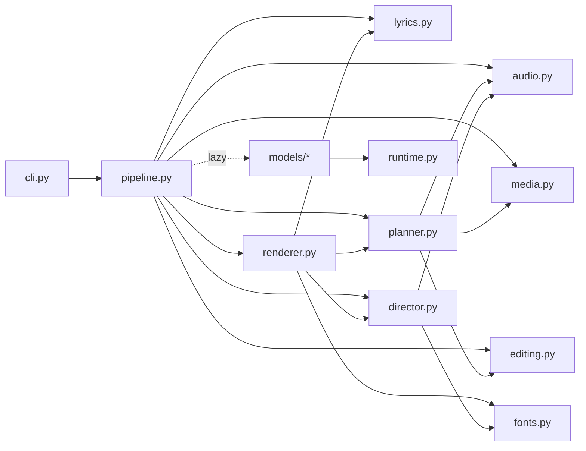
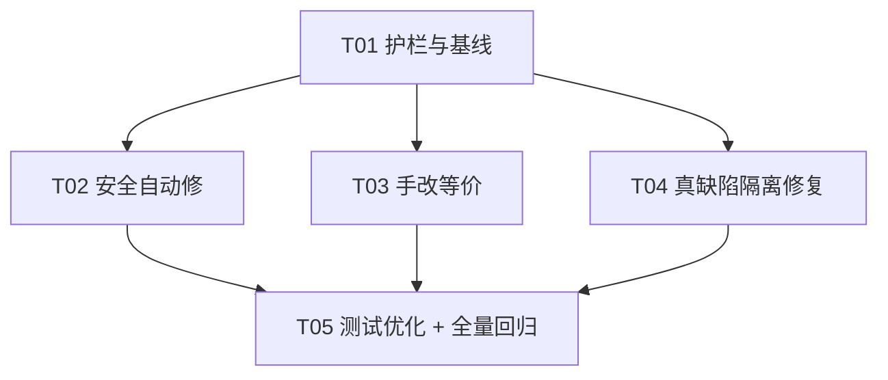

# BeatForge 全项目代码审查 · 行为不变重构方案 · 施工任务列表

> 审查人：架构师 高见远
> 审查对象：`D:\code\BeatForge`（`beatforge/` 22 个源文件 · 6893 行；`tests/` 20 个文件 · 4873 行；`scripts/` 16 个探针 · 2047 行）
> 边界：**行为不变纯重构**。不新增功能、不改渲染输出、不改规划结果、不改公开接口签名。
> 验收：重构前后 `uv run pytest -q` 均为 **378 passed**。
> 结论标注：✅ = 我实测/实跑验证过；🔍 = 读代码得出（未运行验证）；⚠️ = 我明确判断为推测。

---

## 一、审查范围与方法（我实际跑了什么）

| 动作 | 命令 | 结果 |
| --- | --- | --- |
| 基线测试 | `uv run pytest -q` | **378 passed**（72×5 + 18 个点，输出见 `.probe/pytest_baseline.txt`）✅ |
| Lint 全量 | `uv run ruff check --output-format=concise` | **82 errors**（59 可自动修）（`.probe/ruff_all.txt`）✅ |
| Lint 统计 | `uv run ruff check --statistics` | 与 team-lead 提供的分级完全一致 ✅ |
| UP037 影响面 | `uv run ruff check --select UP037 --diff` | 包内 9 行、`tests/test_llama_server.py` 1 行 ✅ |
| 句柄泄漏探针 | `uv run python .probe/probe_sink.py` | 复现 `llama_server` 清理分支可达性 + OS 级句柄占用检测 ✅ |
| 引用可达性 | 逐文件通读 22 个源文件 + 20 个测试文件全文 | — ✅ |
| 语义验证 | `uv run python -c "class Foo: def __enter__(self) -> Foo: ..."` | 证实无 `from __future__ import annotations` 时去引号会 `NameError` ✅ |

**未做（超出边界）**：未跑任何模型推理（ASR/WeML/导演/分离）；未跑真实 FFmpeg 端到端渲染；未做覆盖率统计（依赖 `pytest-cov`，未安装）。凡涉及「模型实际行为」「真实渲染像素」的结论均为 🔍 或 ⚠️。

---

## 二、问题清单（按优先级）

### 总览

| 级别 | 数量 | 说明 |
| --- | --- | --- |
| **P0** | 2 | 真缺陷 / 必须隔离修复 |
| **P1** | 5 | 等价重构中需要人工判断的项 |
| **P2** | 28 | 纯风格/lint，可安全批处理 |
| **不建议动** | 6 类 | 见 §5.3，动了就是引入风险 |

按目录分布（来自 `.probe/ruff_all.txt`）：`beatforge/` **35 条** · `scripts/` **29 条** · `tests/` **18 条**，合计 82。

---

### P0 —— 真缺陷 / 必须隔离修复

| # | 文件:行 | 性质 | 影响 | 建议 | 风险 | 证据 |
| --- | --- | --- | --- | --- | --- | --- |
| **P0-1** | `beatforge/models/llama_server.py:409`（`open()` 在 `:395`） | **清理分支条件写反 → `close()` 是死代码** | 日志文件句柄的显式关闭永不执行；实际依赖 CPython 引用计数在生成器帧销毁时兜底回收 | 把 `if log is None and sink is not subprocess.DEVNULL` 改为 `if log is not None and sink is not subprocess.DEVNULL`；并给 `except OSError` 分支也补一次关闭（见 §4.3 完整改法） | **低**（CPython 下观察不到输出差异） | ✅ 探针实测 |
| **P0-2** | `beatforge/renderer.py:183` | 死局部变量（ruff `F841`） | `frames` 赋值后从未被读取；`_image_filter_graph` 内部自算一份 | 直接删除该行 | **极低**（删除未使用局部变量不可能改变行为） | ✅ 全文核对：`_render_shot`（178–221）内仅 183 行出现 `frames` |

> **P0-1 的定性请务必看 §3.1**：team-lead 描述的「文件句柄永远关不掉」**夸大了**。真实情况是「显式关闭是死代码，但 GC 会回收」。这不改变它能被安全修复，但改变了它的严重级别（不是崩溃级，是潜在缺陷级）。

### P1 —— 等价重构中需要人工判断

| # | 文件:行 | 性质 | 影响 | 建议 | 风险 | 证据 |
| --- | --- | --- | --- | --- | --- | --- |
| P1-1 | `beatforge/models/transcriber.py:74` | 每轮循环新建闭包（ruff `B023`） | 无正确性影响（闭包当轮即调用）；仅一次微小分配 + 可读性 | 提为模块级 `_field(item, key) -> str` 辅助函数，消除闭包分配 | **无** | ✅ 复核（见 §3.2） |
| P1-2 | `beatforge/models/vision_index.py:556` | 类型检查抛 `ValueError`（ruff `TRY004`） | **惰性**：外层 `except (ImportError, AttributeError, TypeError, ValueError)` 会立刻接住并改抛 `RuntimeError`，永不外泄 | **建议不改**（改了也安全，但无收益、动一行就有额外 review 成本）；若要改，`ValueError`→`TypeError` | 无 | ✅ 读过 `_load_cross_encoder` 的 try/except 范围 |
| P1-3 | `beatforge/models/separator.py:89` | 失效的 `# noqa: BLE001`（ruff `RUF100`） | 无运行时影响；但**误导**：读者以为此处被盲抓，其实处理器自带 `raise ... from exc`，ruff 已不判 BLE001 | 删除该 `# noqa`；或按 team-lead 意图统一策略（见 §5.3 BLE001 条目） | 无 | ✅ ruff 输出明确标 `unused: BLE001` |
| P1-4 | `beatforge/models/downloader.py:197` | 盲抓 `Exception`（ruff `BLE001`）且**无** `# noqa` | 与同文件 142/162/230 三处**有** `# noqa` 的同类处理器不一致；此处是「换下一个 provider」的**有意**回退 | 补 `# noqa: BLE001 - the next provider gets a turn`，与兄弟处保持一致（纯注释，零行为变化） | 无 | ✅ 逐行核对 |
| P1-5 | `beatforge/pipeline.py:137` | 盲抓 `Exception`（ruff `BLE001`）且**无** `# noqa` | 这是「导演失败回退规则导演」的**有意**兜底（README 明写「启动失败或输出校验失败时自动回退规则导演」），是设计而非缺陷 | 补 `# noqa: BLE001 - the director stage falls back to the rule director` | 无 | ✅ |

### P2 —— 纯风格 / lint（可批处理）

| # | 规则 | 数量 | 位置 | 建议 | 自动化 |
| --- | --- | --- | --- | --- | --- |
| P2-1 | `I001` 未排序 import | 15 | `cli.py:1`、`config.py:1`、`models/transcriber.py:19`、`models/vision_index.py:1`、`tests/*`、`scripts/*` | 自动修 | ✅ `--fix` 安全 |
| P2-2 | `UP037` 引号注解 | 11 | `config.py:101,186`、`renderer.py:181×2,225×2,245×2,1188`、`tests/test_llama_server.py:285`、`scripts/subtitle_effect_probe.py:67` | 自动修（**已核实全部 4 个文件都带 `from __future__ import annotations`**，去引号不改运行时） | ✅ `--fix` 安全 |
| P2-3 | `F401` 未使用 import | 3 | `cli.py:3`(`json`)、`tests/test_llama_server.py:9`(`SimpleNamespace`)、`tests/test_renderer.py:22`(`_MIN_ZOOM`) | 自动修 | ✅ `--fix` 安全 |
| P2-4 | `F541` 无占位符 f-string | 1 | `tests/test_renderer.py:952` | 自动修 | ✅ `--fix` 安全 |
| P2-5 | `SIM117` 嵌套 with | 1 | `tests/test_llama_server.py:231` | 自动修 | ✅ `--fix` 安全 |
| P2-6 | `PIE808` range 多余起点 | 1 | `scripts/subtitle_layout_probe.py:165` | 自动修 | ✅ `--fix` 安全 |
| P2-7 | `UP035` 弃用 typing import | 2 | `models/downloader.py:7`(`Callable`)、`models/llama_server.py:30`(`Iterator`) | 手改：`from collections.abc import ...` | 安全（Py3.13） |
| P2-8 | `RUF007` zip→pairwise | 7 | `audio.py:144`、`planner.py:121,686`、`tests/test_editing.py:155`、`tests/test_planner.py:64,113,191` | 手改：`itertools.pairwise`（`pairwise(y) == zip(y, y[1:])`，严格等价） | 安全 |
| P2-9 | `C405` 多余 list 字面量 | 3 | `audio.py:104,108`、`planner.py:450` | 手改：`set([a, b, *c])` → `{a, b, *c}` | 安全 |
| P2-10 | `RUF046` 多余 int() | 1 | `models/vision_index.py:39` | 手改：删除 `int(round(...))` 外的 `int()` | 安全（`round(float)` 已返回 `int`） |
| P2-11 | 失效 `# noqa`（脚本） | 24 | `scripts/` 5 个文件（`E402`×23、`PLC0415`×1） | 删除（`E402/PLC0415` 未在启用集内） | 安全 |

> **关于 RUF100=25 的更正**：team-lead 说「25 个失效 noqa 说明有重构残留」。实测分布：**24 个在 `scripts/`**（为了一个根本没启用的 `E402` 规则挂的 `# noqa`），**只有 1 个在包内**（`separator.py:89`）。所以「重构残留」这个判断对 `beatforge/` 基本不成立，它们是脚本的噪音。

---

## 三、三条待定性结论的复核结果

### 3.1 `llama_server.py:395` 句柄泄漏 —— 部分成立，但被夸大 ✅

**代码（395–410）**：

```python
sink = open(log, "wb") if log is not None else subprocess.DEVNULL
...
finally:
    server.stop()
    if log is None and sink is not subprocess.DEVNULL:   # ← 条件写反
        sink.close()
```

**逻辑分析**：

| 分支 | `log` | `sink` | `log is None` | `sink is not DEVNULL` | 会执行 close？ |
| --- | --- | --- | --- | --- | --- |
| 给了日志文件 | not None | 文件对象 | False | True | **否** |
| 未给日志 | None | `DEVNULL`(-3) | True | False | 否（正确，DEVNULL 不应关） |

两个条件**互斥**，文件分支的 `close()` 永不执行。**这一段是死代码，事实成立。**

**但「文件句柄永远关不掉」是错的。** 我用 OS 级手段实测（`.probe/probe_sink.py`）：

```
== case A：给了 log，调用方持有引用 ==
  explicit-close branch reachable? False
  after function returned, handle state: LOCKED (handle still open!)
== case B：给了 log，帧销毁（等价于生成器的真实情形）==
  explicit-close branch reachable? False
  after frame died: UNLINKED (handle released)     ← GC 把它关了
== case C：log=None（devnull，本就不该关）==
  explicit-close branch reachable? False
```

在真实调用点 `_treat_with_llamacpp` 里是 `with open_server(...) as server:`；`with` 退出后 `_GeneratorContextManager` 临时对象被丢弃 → 生成器帧销毁 → 局部引用归零 → **CPython 立即回收文件对象并 flush**。所以：

- ❌ 不是「句柄泄漏到进程结束」；
- ❌ 不是「日志尾部丢失」（CPython 引用计数下是会 flush 的）；
- ✅ **是**：显式清理是死代码；日志的落盘时机被交给 GC；在非引用计数实现（PyPy）或帧被引用环挂住时才可能延迟。

**结论：「真缺陷」成立，但级别是 P0（潜在缺陷 / 死清理），不是「泄漏」级。** 我把它列为 P0-1，是因为它值得一个**独立的、带注释的修复提交**，而不是因为它会造成渲染差异。

**修它算不算「行为不变」？** —— 在 CPython 上**观察不到任何输出差异**（日志内容、渲染、规划全部不变），属于「修复潜在缺陷但不改变可观察行为」。建议按「bugfix」提交并写清 `close 时机` 这一点，不要在纯风格批里夹带。

### 3.2 `transcriber.py:74` 每轮闭包 —— 确认不是 bug ✅

```python
value = item.get if isinstance(item, dict) else lambda key: getattr(item, key)
token = LyricToken(str(value("text")), float(value("start_time")), float(value("end_time")))
```

`value` 当轮立即被调用三次，捕获的循环变量 `item` 就是当轮的值，**无 B023 语义风险**。定性：可读性 + 一次微小分配。**建议**提为模块级函数（保留 dict→`.get` 返回 `None`、对象→`getattr` 抛 `AttributeError` 的原始差异）：

```python
def _field(item: Any, key: str) -> Any:
    return item.get(key) if isinstance(item, dict) else getattr(item, key)
```

### 3.3 `renderer.py:183` 死代码 —— 确认可安全删除 ✅

`frames = max(1, round(render_duration * cfg.fps))` 之后，image 分支 `return`，video 分支全程不引用 `frames`；`_image_filter_graph`（:623）另算一份同名变量。**纯死代码**，删除不可能改变行为。

---

## 四、重构方案

### 4.1 分批策略

分 5 批，**每批结束都必须 `uv run pytest -q` 且 diff 只看本批内容**。批次之间**独立提交**，禁止「一次提交改全部」。

| 批 | 名称 | 内容 | 自动化程度 | 行为风险 | 回滚粒度 |
| --- | --- | --- | --- | --- | --- |
| **A** | 护栏与基线 | 引入 ruff 配置到 `pyproject.toml`；清理 24 条脚本死 noqa；固化基线命令 | 半自动 | 零 | 单提交 |
| **B** | 安全自动修 | `ruff check --fix`（`I001/UP037/F401/F541/SIM117/PIE808`，59 处中属于本类的全部） | 全自动 | 零（**UP037 依赖 future import，已核实**） | 单提交 |
| **C** | 手改等价 | `UP035`×2、`RUF007`×7、`C405`×3、`RUF046`×1、`RUF100`×1、`BLE001` noqa×2 | 手动 | 零（逐行等价可证） | 单提交 |
| **D** | 真缺陷（隔离） | `llama_server` 清理条件；`renderer:183` 死变量；`transcriber:74` 辅助函数 | 手动 | 极低（CPython 下观察不到差异） | **每文件单独提交** |
| **E** | 测试优化 + 回归 | 见 §7；之后跑全量回归 | 手动 | 零（只动测试） | 单提交 |

**批次间依赖**：A → (B ‖ C ‖ D) → E。B/C/D 互不重叠文件时可并行；D 必须与 B/C 分开提交。

### 4.2 每批的验证方式

| 批 | 验证命令 | 通过判据 |
| --- | --- | --- |
| A | `uv run ruff check --statistics` + `uv run pytest -q` | 只剩 B/C 待修的规则码；**378 passed** |
| B | `uv run ruff check` + `git diff --stat` 抽查 + `uv run pytest -q` | 剩余错误数 = 82 − 已修；**378 passed**；diff 仅出现在 import/注解/无占位符 f-string |
| C | `uv run ruff check` + `uv run pytest -q` | 包内 `beatforge/` 除 `B008` 外归零；**378 passed** |
| D | `uv run pytest -q` + 单独跑 `tests/test_llama_server.py tests/test_renderer.py tests/test_transcriber.py` | **378 passed**（`test_llama_server` 全部通过） |
| E | `uv run pytest -q` | **378 passed**（允许测试条数变化，但 `passed` 数须与新基线一致并记录） |

> **硬门槛**：任何一批后 `pytest` 不是全绿，**立即回滚该批**，不允许「下一批再修」。

### 4.3 P0-1 的推荐改法（可直接照抄）

最小改动版（保持原风格，只修条件 + 补 OSError 路径）：

```python
sink = open(log, "wb") if log is not None else subprocess.DEVNULL
try:
    process = subprocess.Popen(
        command, stdout=sink, stderr=subprocess.PIPE if log is None else sink,
        env=_launch_environment(executable.parent),
    )
except OSError as exc:
    if log is not None:
        sink.close()
    raise LlamaServerError(f"无法启动 {executable}：{exc}") from exc
server = LlamaServer(base_url=f"http://127.0.0.1:{chosen}", process=process)
try:
    _wait_until_ready(server, process)
    yield server
finally:
    server.stop()
    if log is not None:
        sink.close()
```

更彻底版：用 `contextlib.ExitStack` 统一管理 `sink` 与进程（一并满足 ruff `SIM115`）。**二选一，不要都上。**

### 4.4 明确「不建议动」的部分

| 项 | 为什么不动 |
| --- | --- |
| **`cli.py` 的 5 处 `B008`**（`typer.Argument/Option` 在默认值里） | typer 的**官方惯用法**，不是缺陷。改写法会改变 CLI 元数据推导。→ 在 ruff 配置里 `per-file-ignores` 忽略，**不是修代码** |
| **`E501` 超长行 524 处** | 绝大多数是中文文案/长 filter 字符串；截断反而破坏可读性与字符串语义 |
| **`RUF001/002/003` 全角标点 300+** | 代码里的中文文案（注释、`print`、提示词）。**纯噪音**，一律不按它改 |
| **`create_plan`(188 行) / `run_project`(152 行) / `_composite_graph`(130 行) / `_camera_quad`(89 行) 的拆分** | 见 §6 复杂度热点分析：这些是**线性流程 + 大量跨变量不变量**（三个计数器、`amount` 复用、包围盒量程）。拆函数会把这些不变量变成跨函数参数传递，**是本项目最容易被拆坏的地方**。纯重构禁区内 |
| **`audio.py` 的三次全量解码**（analysis 22k / CLAP 48k / All-In-One） | 收益小、要动三个模块接口。旧 review 已列为低优先 |
| **`_camera_quad` / `_quad_spread` 的 `amount` 统一、`clip((on-1)/(frames-1),0,1)`** | README 明写的不变量，**任何重构都不得触碰** |

### 4.5 引入 ruff 的建议配置（放 `pyproject.toml`）

```toml
[tool.ruff]
line-length = 100          # 先不动 E501；如需可后续单开
target-version = "py313"

[tool.ruff.lint]
select = ["E4", "E7", "E9", "F", "I", "UP", "B", "C4", "SIM", "RUF", "PIE"]
# 保留 E501 在 select 之外（默认就不在），避免 524 处中文长行噪音
ignore = ["TRY004"]        # 见 P1-2：惰性且无收益

[tool.ruff.lint.per-file-ignores]
"beatforge/cli.py" = ["B008"]          # typer 惯用法，见 §4.4
"scripts/*" = ["E402", "PLC0415"]      # 探针脚本的 sys.path 操作
```

> 引入本配置后，`ruff check` 应稳定报出「B/C 批待修」的少量条目；A/B/C/D 全部完成后应归零（或仅剩已被 `ignore` 的 `TRY004`）。

---

## 五、给工程师的有序任务列表（施工顺序）

> 施工人：工程师 寇豆码。**每个任务都必须独立提交，且提交后立即跑验证命令。**
> 依赖图见 §6.3。任务数 **5**（符合硬上限）。

### T01 · 护栏与基线固化　`P0`　依赖：无

- **目标文件**：`pyproject.toml`、`beatforge/models/separator.py`、`scripts/camera_look_check.py`、`scripts/camera_move_probe.py`、`scripts/effects_preview.py`、`scripts/font_probe.py`、`scripts/reuse_probe.py`、`scripts/vision_input_probe.py`
- **改动内容**：
  1. 写入 §4.5 的 `[tool.ruff]` 配置；
  2. 删除 `separator.py:89` 的失效 `# noqa: BLE001`；
  3. 删除 `scripts/` 5 个文件里的 24 条失效 `# noqa`（`E402`/`PLC0415`）；
  4. 在提交信息里记录基线：`378 passed`、`ruff: 82 errors`。
- **风险**：无（配置 + 注释）。
- **验证命令**：`uv run ruff check --statistics`（错误数应下降 25）；`uv run pytest -q` → **378 passed**。

### T02 · 安全自动修　`P0`　依赖：T01

- **目标文件**：`beatforge/cli.py`、`beatforge/config.py`、`beatforge/models/transcriber.py`、`beatforge/models/vision_index.py`、`beatforge/renderer.py`、`tests/test_renderer.py`、`tests/test_llama_server.py`、`scripts/subtitle_effect_probe.py`、`scripts/subtitle_layout_probe.py`
- **改动内容**：`uv run ruff check --fix`（覆盖 `I001/UP037/F401/F541/SIM117/PIE808`）。**修完逐条 `git diff` 复核**，确认只有 import 排序、去引号、删未用 import、去 `f` 前缀、合并 `with`、去 `range` 起点。
- **风险**：低。唯一需要盯的是 `UP037`——**已核实这 4 个文件都带 `from __future__ import annotations`，去引号是 no-op**；若未来新增文件缺该 future import，同一修复会 `NameError`（我已用 `class Foo: def __enter__(self)->Foo` 实测确认会抛）。
- **验证命令**：`uv run ruff check`；`uv run pytest -q` → **378 passed**。

### T03 · 手改等价重构　`P1`　依赖：T01（可与 T02 并行，文件不重叠）

- **目标文件**：`beatforge/models/downloader.py`、`beatforge/models/llama_server.py`、`beatforge/audio.py`、`beatforge/planner.py`、`beatforge/models/vision_index.py`、`beatforge/pipeline.py`
- **改动内容**：
  1. `UP035`：`Callable`/`Iterator` 改从 `collections.abc` 导入；
  2. `RUF007`：`audio.py:144`、`planner.py:121`、`planner.py:686` 的 `zip(x, x[1:])` → `itertools.pairwise(x)`；
  3. `C405`：`audio.py:104,108`、`planner.py:450` 的 `set([...])` → `{...}`；
  4. `RUF046`：`vision_index.py:39` 删多余 `int()`；
  5. `BLE001`：`downloader.py:197`、`pipeline.py:137` 补 `# noqa: BLE001 - <理由>`（纯注释）。
- **风险**：低。`pairwise` 与 `set-literal` 均为严格等价；注意 `{...}` 展开语法在空 range 下与 `set([])` 同为 `set()`。
- **验证命令**：`uv run ruff check`（包内除 `B008`/`TRY004` 归零）；`uv run pytest -q` → **378 passed**。

### T04 · 真缺陷修复（每文件单独提交）　`P0`(llama) + `P2`　依赖：T01（不要与 T02/T03 混在同一提交）

- **目标文件**：`beatforge/models/llama_server.py`、`beatforge/renderer.py`、`beatforge/models/transcriber.py`
- **改动内容**：
  1. `llama_server.py`：按 §4.3 修复清理条件（并补 `except OSError` 路径的关闭），提交信息注明「显式 close 原为死代码；CPython 下输出无差异」；
  2. `renderer.py:183`：删除死变量 `frames`；
  3. `transcriber.py:74`：`value = ...` 提为模块级 `_field(item, key)`，保持 dict/对象两条语义。
- **风险**：低。`llama_server` 是本批唯一改控制流的，务必单独提交以便回滚。
- **验证命令**：`uv run pytest -q tests/test_llama_server.py tests/test_renderer.py tests/test_transcriber.py -q`；再 `uv run pytest -q` → **378 passed**。

### T05 · 测试优化 + 全量回归　`P0`　依赖：T02、T03、T04

- **目标文件**：`tests/test_renderer.py`、`tests/test_llama_server.py`、`tests/test_planner.py`、`tests/test_editing.py`、`tests/test_vision_index.py`、`tests/test_vision_rerank.py`（+ 视新增共享 fixture 而定）
- **改动内容**：落实 §7 的 QA 输入（去重、补强弱断言、补盲区、加速点）。**只动测试，不动被测代码**。
- **风险**：零（若某条测试改后失败，说明它原来就在测错误的东西——需回报，不要顺手改实现）。
- **验证命令**：`uv run pytest -q`；记录最终 `passed` 数并更新基线。

---

## 六、复杂度热点与重构禁区

### 6.1 AST 实测热点（team-lead 提供，我复核了调用关系）

| 行数 | 分支 | 函数 | 文件 | 我的判断 |
| --- | --- | --- | --- | --- |
| 188 | 60 | `create_plan` | `planner.py` | ⛔ **不动**：三个计数器 + 富余素材账 + 复用账 + 语义打分全在一段循环里共享状态，拆开即散 |
| 152 | 29 | `run_project` | `pipeline.py` | ⛔ 不动：线性阶段编排，拆了更难跟（旧 review 同结论） |
| 130 | 15 | `_composite_graph` | `renderer.py` | 🟡 可抽子函数，但**本 pass 不动**：每条早返回路径都对应一条被测试钉住的版式不变量 |
| 118 | 32 | `download_required_models` | `models/downloader.py` | 🟡 provider 循环可抽 `_fetch_snapshot`，收益小 |
| 99 | 20 | `_subtitle_effect` | `lyrics.py` | ⛔ 不动：16 个 effect 的分支表，拆开反而丢可读性 |
| 95/89 | 13/11 | `_image_filter_graph` / `_camera_quad` | `renderer.py` | ⛔ **禁区**：`amount` 复用、包围盒量程、`on` 偏移是 README 不变量 |

### 6.2 跨文件依赖与调用流（重构影响面）



> 重构**只应触碰叶子节点**（`downloader` / `llama_server` / `transcriber` / `vision_index` / `separator` / `runtime`）与 `renderer` 的死代码。`planner → renderer → director → fonts` 这条主链**一个签名都不要改**。

### 6.3 任务依赖图



---

## 七、给 QA「严过关」的测试审查输入

> 现状：测试质量**整体很高**（守门断言、可达性扫描、精确帧数断言都是全项目最值得保留的部分）。下面是可改进项，按类型分组。**所有判断均为读代码所得（🔍），未跑覆盖率工具。**

### 7.1 重复 / 可合并

| # | 位置 | 问题 |
| --- | --- | --- |
| Q1 | `tests/test_vision_index.py:86` 与 `tests/test_vision_rerank.py:6` | 两条测试都在验 `blend_rerank_scores`（形状/序），**跨文件重复**；保留信息更全的那条 |
| Q2 | `tests/test_llama_server.py:278` `_FakeResponse` 与 `:398` `Response` | 同一个「可 `with` 的假响应」写了两遍；抽一个共享类 |
| Q3 | `tests/test_renderer.py` 内 `_transition_art` / `_composite_art` / `_image_filters` 以及大量内联 `AudioAnalysis(...)` 字面量 | 同一 `AudioAnalysis` 夹具重复十余次；建议提 `make_analysis(...)` 工厂 |
| Q4 | `tests/test_planner.py:463 _varied_song` 与 `test_editing.py:16 _song` | 两个近似的「全段落歌曲」夹具，字段几乎一致 |
| Q5 | `RUF007`：`test_editing.py:155`、`test_planner.py:64,113,191` | 测试内 `zip(x, x[1:])` 可 `pairwise`（属 T02/T03 顺带） |

### 7.2 断言过弱 / 可被证伪

| # | 位置 | 问题 | 建议 |
| --- | --- | --- | --- |
| Q6 | `tests/test_renderer.py:738` | `assert f"st={...}" in ... or "st=" in " ".join(outgoing)`——第二个析取项几乎恒真，整条退化成「contains `st=`」 | 删掉 `or` 分支，直接断言 `st=<duration-seconds>` |
| Q7 | `tests/test_audio.py:4` | 全文件仅一条 `_heuristic_mood` 归一性断言，`max in {energetic, uplifting}` 面太宽 | 加两三个端点用例（极低能/极高 BPM）钉住映射 |
| Q8 | `tests/test_music_structure.py` | 只覆盖 `allin1` 后端，`beat-this` 分支零覆盖 | 补一条 `beat-this` 的 monkeypatch 用例 |
| Q9 | `tests/test_fonts.py:44` | `assert path.read_bytes()[:4] in (...)`——`true` 分支（`b"true"`）实际不会出现在 `.ttf` 头，属冗余但无害 | 可保留 |

### 7.3 覆盖盲区（按风险排序）

| # | 盲区 | 风险 | 建议补法 |
| --- | --- | --- | --- |
| Q10 | **`renderer.py::_render_shot` 的 video 分支（189–221）** | 高：真实成片里视频镜头走这里，但**所有测试都用 image 镜头**（含 e2e） | 加一条用真视频源（或 `-f lavfi` 造）的 `_render_shot` 断言「产出存在 + 帧数正确」；**它也是 P0-2 死代码长期存活的根因** |
| Q11 | `models/audio_semantics.py::classify_music` | 中：真实路径（`pipeline.py:91`），0 覆盖 | 不需真模型：覆盖「>30s 取 3×5s 中心 / ≤30s 整段」的裁剪逻辑 + 返回覆盖 7 个 `MOOD_LABELS` + 归一性 |
| Q12 | `pipeline.py::run_project` 主流程 | 中：只在 `speech_source` 有覆盖 | 加 `--plan-only --no-ai` 级别的轻量 e2e（造合成音频+图，忌模型） |
| Q13 | `cli.py` 的 `init` / `run` / `download-models` | 低 | `CliRunner` 冒烟：`init` 建目录+模板即可 |
| Q14 | `fonts.py::_fontconfig_families` / `_windows_font_families` | 低 | 平台相关，可 skipif |
| Q15 | `transcriber.py` 的 `_transcribe_qwen`（模型路径） | 低（无 GPU 不可测） | 保持现状，明确标注「需真机」 |

### 7.4 可加速点（当前 53.46s，瓶颈是 FFmpeg 子进程）

| # | 位置 | 现状 | 建议 |
| --- | --- | --- | --- |
| Q16 | `tests/test_renderer.py::test_every_transition_in_the_library_actually_composes` | 2 个 clip 造好，再对 58 个转场各起一次 `ffmpeg`（58 次子进程） | 合并为一条长 `filter_complex`（或分批），可省数十次进程启动 |
| Q17 | `tests/test_renderer.py::test_every_transition_name_is_a_real_xfade_transition` | 又起一次 `ffmpeg -h` | 与 Q16 共用一次 `-h` 结果（session 级 fixture） |
| Q18 | 全渲染类测试 | 每个测试自造 `music.wav` / 图片 | 提 session 级 `tmp` 媒体 fixture 复用 |
| Q19 | `test_fonts.py::test_a_requested_weight_actually_reaches_the_rendered_frame` | 3 个 weight × 2 次 ffmpeg | 可接受；若要快，共用同一背景 clip |

> **总判断**：测试不需要「增加条数」，需要的是 **Q10（video 分支盲区）** 与 **Q6（弱断言）**。这两条一个补上了长期无人看守的渲染路径，一个堵住了一条形同虚设的断言。

---

## 八、整体安全判断

| 问题 | 我的判断 |
| --- | --- |
| **这次重构安全吗？** | **安全**。82 条 lint 中 59 条是纯自动等价修复；剩余手改项我已逐条给出等价证明；唯一触碰控制流的是 `llama_server` 的清理条件，且它在 CPython 下**不产生任何可观察差异**，还被隔离成单独提交。 |
| **最大风险点** | 不是代码，是**施工纪律**：把「自动修 + 手改 + 真缺陷」混成一个提交，一旦 `pytest` 变红无法定位。→ 用 §5 的 5 个任务、每任务独立提交、每任务跑 378。 |
| **会不会破坏 README 里的不变量？** | 不会——方案不碰 `planner`/`renderer` 的任何几何或计数器逻辑，只删一个死变量、改一处清理条件、换几处等价写法。三个计数器、`amount` 复用、`fontsdir` 单目录、`clip((on-1)/(frames-1),0,1)` 全部原样。 |
| **需要真机验证吗？** | 不需要。本轮验收标准是 `378 passed`，纯单元测试不加载模型。渲染正确性由现有守门测试 + 探针脚本保证，本轮不改渲染逻辑。 |
| **剩余不确定项** | ① Q10 的 video 分支至今无测试，删除 `frames` 后仍无测试守护（但删除未用变量不可能致变）；② `TRY004` 我建议 `ignore` 而非修，属主观取舍。 |

---

## 附：产物与环境

- 本文件：`docs/review/architecture-review.md`
- 模块依赖图：`docs/review/class-diagram.mermaid`
- 关键调用流：`docs/review/sequence-diagram.mermaid`
- 复现证据目录：`.probe/`（`ruff_all.txt`、`ruff_stats.txt`、`up037_diff.txt`、`pytest_baseline.txt`、`probe_sink.py`、`probe_sink.out.txt`）
